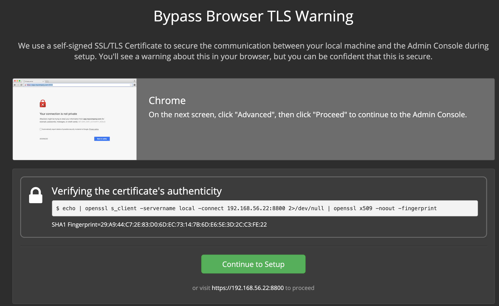
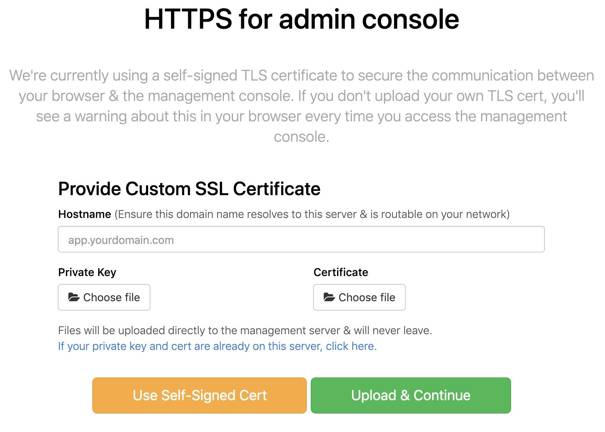
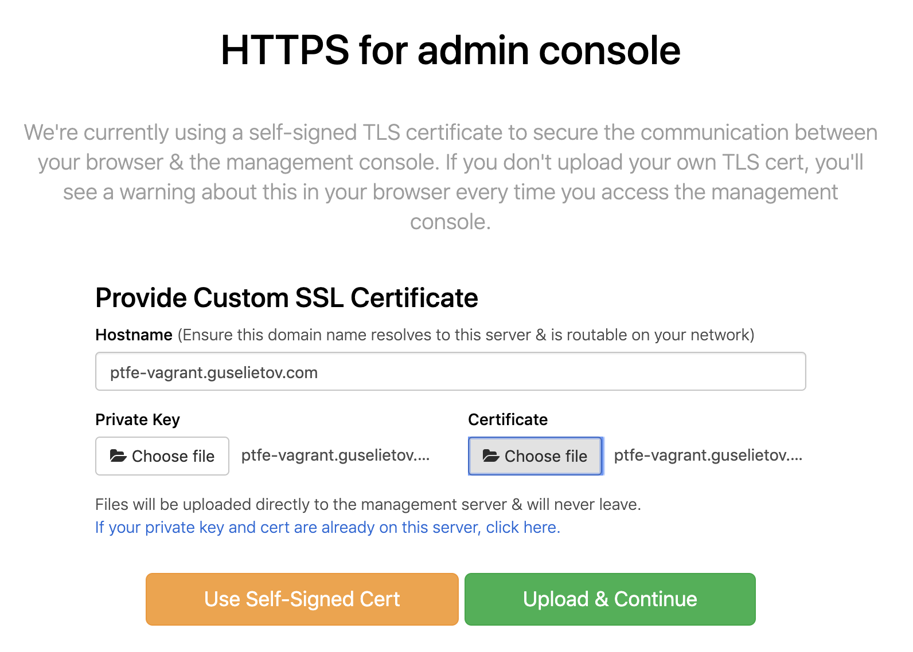
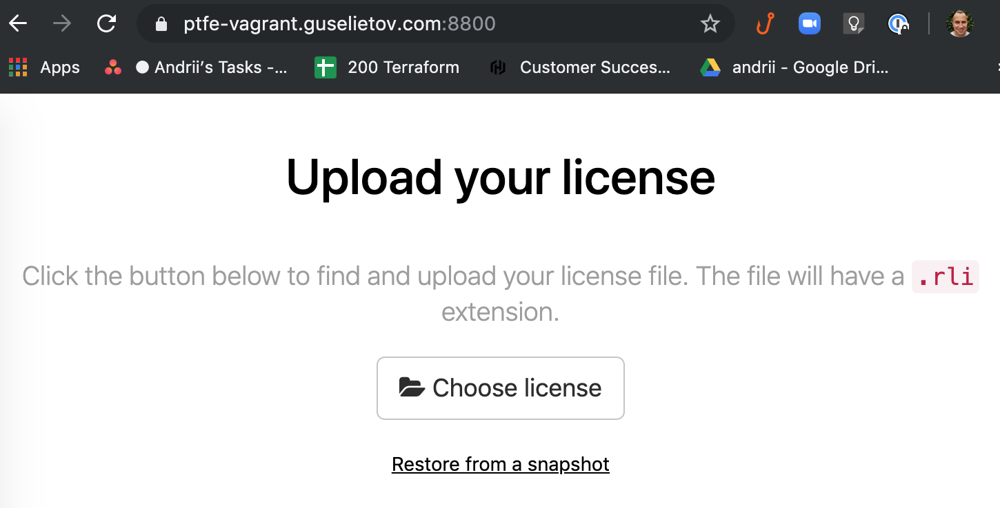
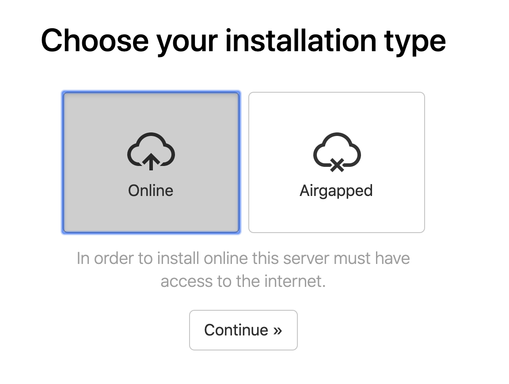
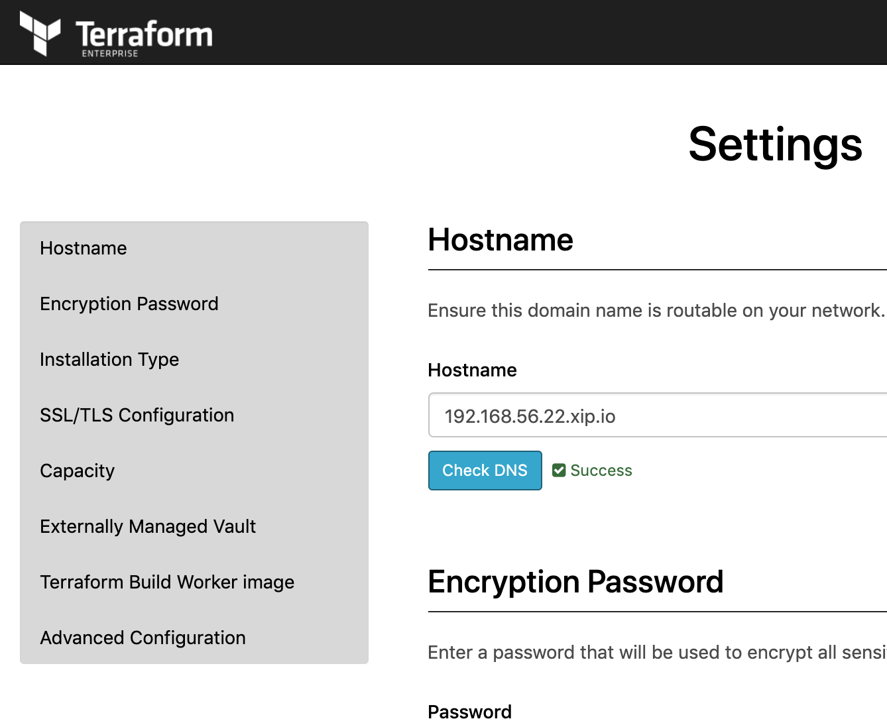
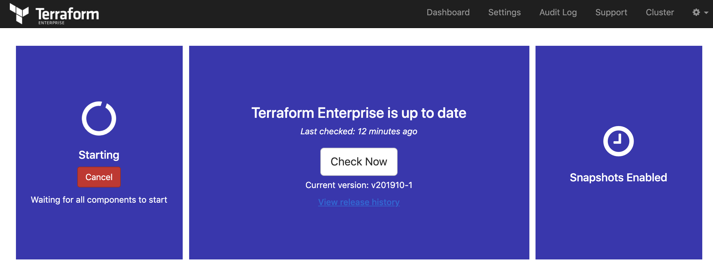
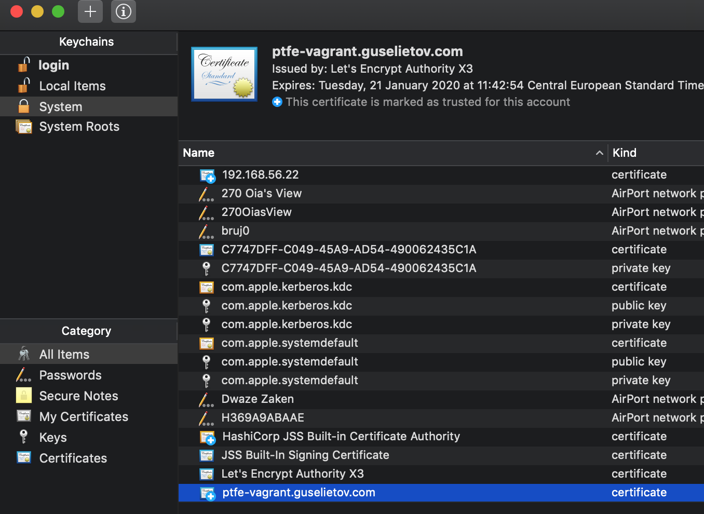
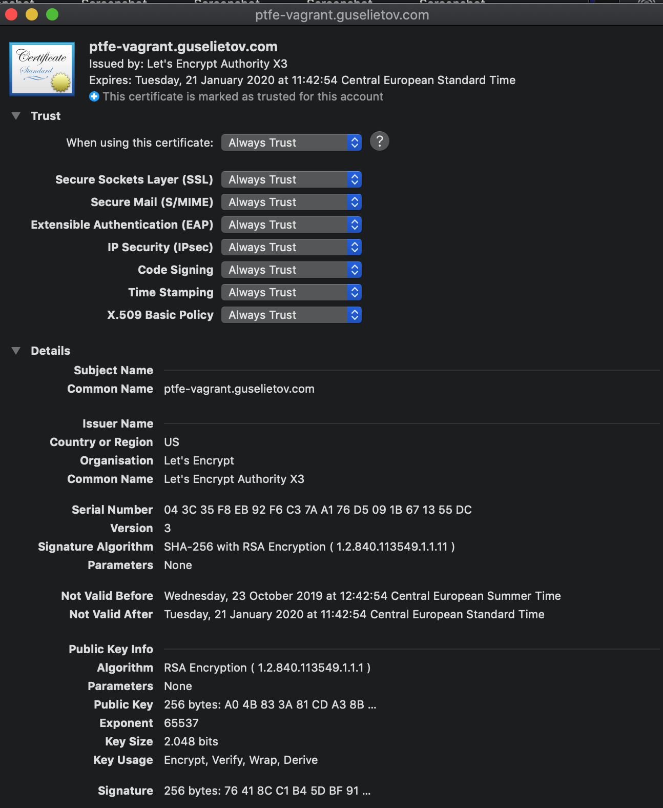
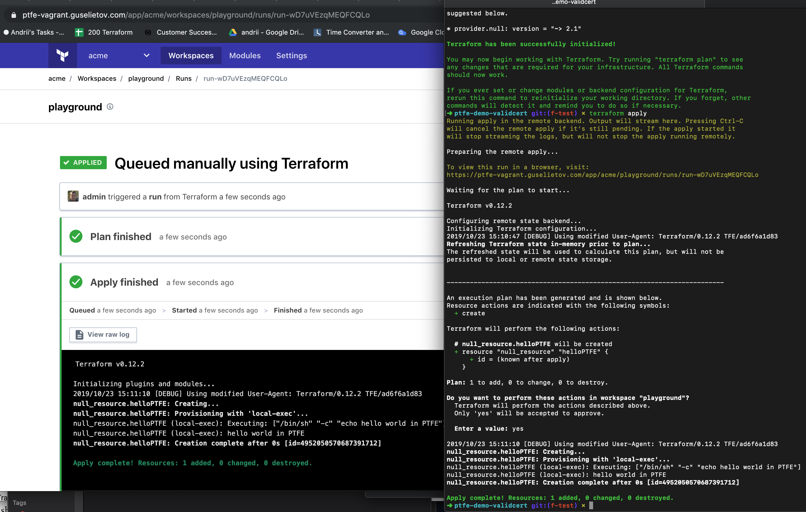

# ptfe-demo-validcert
Install PTFE on Demo version with Valid Certificate - vagrant

# Purpose
Install PTFE on Demo version with Valid Certificate in Vagrantr environment, this repos contins the aprropiate Vagrantfile with instructions.

# Requirements

TFE Overview : https://www.terraform.io/docs/enterprise/index.html

Pre-Install checklist : https://www.terraform.io/docs/enterprise/before-installing/index.html

This repository assumes general knowledge about Terraform, if not, please get yourself accustomed first by going through [getting started guide for Terraform](https://learn.hashicorp.com/terraform?track=getting-started#getting-started). We also going to use Vagrant with VirtualBox.

To learn more about the mentioned above tools and technologies -  please check section [Technologies near the end of the README](#technologies)

# How-to

- Prepare certificate -> The installer allows for using a certificate signed by a public or private CA. If you do not use a trusted certificate, your VCS provider will likely reject that certificate when sending webhooks. The key and X.509 certificate should **both be PEM (base64) encoded**.
> Note : Never save your certificate and private key in VCS (GitHUb or any other).
> Use any method to create certificates for appropriate name and prepare them soewhere in a sae private place, outside your VCS-controlled folders.
For this repo we have 2 files for the FQDN `ptfe-vagrant.guselietov.com`  : 
    ```bash
    ls -l ~/Certs/ptfe-vagrant.guselietov.com*
    -rw-r--r--  1 andrii  staff  1945 Oct 23 13:47 /Users/.../Certs/ptfe-vagrant.guselietov.com.cert.pem
    -rw-r--r--  1 andrii  staff  1676 Oct 23 13:47 /Users/.../Certs/ptfe-vagrant.guselietov.com.key.pem
    ```
    > Note 2, if you are using private CA (Certificate Authority ) then you also need to prepare CA Bundle. Terraform Enterprise needs to be able to access all services that it integrates with, such as VCS providers or database servers. Because it typically accesses them via SSL/TLS, it is critical that the certificates used by any service that Terraform Enterprise integrates with are trusted by Terraform Enterprise. A collection of certificates for trusted issuers is known as a Certificate Authority (CA) Bundle. All certificates in the certificate signing chain, meaning the root certificate and any intermediate certificates, must be included here. These multiple certificates are listed one after another in text format. Please prepare such file, you going to need it to test your installation later.

- Add proper domain record (type "A") with the tools of your choice for your DNS provider pointing to IP-addres `192.168.56.22` for the host `ptfe-vagrant.guselietov.com . In this case - GoDaddy, via Web-console. Checking result :
    ```bash
    $ dig ANY ptfe-vagrant.guselietov.com

    ; <<>> DiG 9.10.6 <<>> ANY ptfe-vagrant.guselietov.com
    ;; global options: +cmd
    ;; Got answer:
    ;; ->>HEADER<<- opcode: QUERY, status: NOERROR, id: 18697
    ;; flags: qr rd ra; QUERY: 1, ANSWER: 1, AUTHORITY: 0, ADDITIONAL: 1

    ;; OPT PSEUDOSECTION:
    ; EDNS: version: 0, flags:; udp: 4096
    ;; QUESTION SECTION:
    ;ptfe-vagrant.guselietov.com.	IN	ANY

    ;; ANSWER SECTION:
    ptfe-vagrant.guselietov.com. 3600 IN	A	192.168.56.22

    ;; Query time: 22 msec
    ;; SERVER: 192.168.2.254#53(192.168.2.254)
    ;; WHEN: Wed Oct 23 13:54:18 CEST 2019
    ;; MSG SIZE  rcvd: 72

    ```
- Download copy of the code (*clone* in Git terminology) - go to the location of your choice (normally some place in home folder) and run in terminal; in case you are using alternative Git Client - please follow appropriate instruction for it and download(*clone*) [this repo](https://github.com/Galser/ptfe-demo-validcert.git). 
```
git clone https://github.com/Galser/ptfe-demo-validcert.git
```

- Previous step should create a folder that contains a copy of the repository. The default name is going to be the same as the name of repository e.g. `ptfe-demo-validcert`. Locate and open it.
    ```
    cd ptfe-demo-validcert
    ```
- We going to run install PTFE in virtual machine, to prepare that virtual machine please run :
    ```
    vagrant up
    ``` 
    > Command above will utilize settings from [Vagrantfile](Vagrantfile) prepared in this repo
 
    First-time start can take some time, as Vagrant need to download and import box image, and you can see something like this :
    ```bash
    Bringing machine 'default' up with 'virtualbox' provider...
    ==> default: Box 'galser/bionic64-for-ptfe' could not be found. Attempting to find and install...
        default: Box Provider: virtualbox
        default: Box Version: >= 0
    ==> default: Loading metadata for box 'galser/bionic64-for-ptfe'
        default: URL: https://vagrantcloud.com/galser/bionic64-for-ptfe
    ==> default: Adding box 'galser/bionic64-for-ptfe' (v0.0.1) for provider: virtualbox
        default: Downloading: https://vagrantcloud.com/galser/boxes/bionic64-for-ptfe/versions/0.0.1/providers/virtualbox.box
        default: Download redirected to host: vagrantcloud-files-production.s3.amazonaws.com
    ==> default: Successfully added box 'galser/bionic64-for-ptfe' (v0.0.1) for 'virtualbox'!
    ==> default: Importing base box 'galser/bionic64-for-ptfe'...
    ==> default: Matching MAC address for NAT networking...
    ==> default: Checking if box 'galser/bionic64-for-ptfe' version '0.0.1' is up to date...
    ==> default: Setting the name of the VM: ptfe-demo-validcert
    ==> default: Clearing any previously set network interfaces...
    ==> default: Preparing network interfaces based on configuration...
        default: Adapter 1: nat
        default: Adapter 2: hostonly
    ==> default: Forwarding ports...
        default: 22 (guest) => 2222 (host) (adapter 1)
    ==> default: Running 'pre-boot' VM customizations...
    ==> default: Booting VM...
    ==> default: Waiting for machine to boot. This may take a few minutes...
        default: SSH address: 127.0.0.1:2222
        default: SSH username: vagrant
        default: SSH auth method: private key
        default: 
        default: Vagrant insecure key detected. Vagrant will automatically replace
        default: this with a newly generated keypair for better security.
        default: 
        default: Inserting generated public key within guest...
        default: Removing insecure key from the guest if it's present...
        default: Key inserted! Disconnecting and reconnecting using new SSH key...
    ==> default: Machine booted and ready!
    ==> default: Checking for guest additions in VM...
    ==> default: Setting hostname...
    ==> default: Configuring and enabling network interfaces...
    ==> default: Mounting shared folders...
        default: /vagrant => /Users/.../ptfe-demo-validcert    
    ```
- Login to you fresh VM , to do so execute : 
    ```
    vagrant ssh
    ```
    You should see : 
    ```
    Welcome to Ubuntu 18.04.2 LTS (GNU/Linux 4.15.0-55-generic x86_64)

    * Documentation:  https://help.ubuntu.com
    * Management:     https://landscape.canonical.com
    * Support:        https://ubuntu.com/advantage
    ```
- Now, from a shell on your instance:
    - To execute the installer directly, run 
    ```bash
    curl https://install.terraform.io/ptfe/stable | sudo bash
    ```
    - To inspect the script locally before running, run 
    ```bash
    curl https://install.terraform.io/ptfe/stable > install.sh
    ```
    and, once you are satisfied with the script's content, execute it with 
    ```bash
    sudo bash install.sh
    ```

>Note The installation will take a few minutes and you'll be presented with a message about how and where to access the rest of the setup via the web at the end.   This will be [http://192.168.56.22:8800](http://192.168.56.22:8800).  For the guidelines on the possible questions during this portion of the setup, see the next section. 

### Example of the terminal (shell) part of the installation and possible questions 
- Start of the installation : 
    ```bash
    sudo bash install.sh 
    Determining local address
    The installer was unable to automatically detect the private IP address of this machine.
    Please choose one of the following network interfaces:
    [0] enp0s3	10.0.2.15
    [1] enp0s8	192.168.56.22
    [2] docker0	172.17.0.1    
    ```
    At the screen above, installer is not able to correctly choose private IP address, you need to choose. For our example the correct one is number [1]
- Proceed with it :
    ```bash
    Enter desired number (0-1): 1
    The installer will use network interface 'enp0s8' (with IP address '192.168.56.22').
    Determining service address
    The installer was unable to automatically detect the service IP address of this machine.
    Please enter the address or leave blank for unspecified.
    Service IP address: 192.168.56.22
    ```
    And again , supply the address `192.168.56.22`
- Continue :     
    ```bash
    Does this machine require a proxy to access the Internet? (y/N) n
    ```
    Well, this answer depends from your local setup, but in our case is "NO", so we entering `n`
- Continuation, there going to be no more questions, installation nis going to continue for several minutes :
    ```bash
    Installing docker version 18.09.2 from https://get.replicated.com/docker-install.sh
    # Executing docker install script, commit: UNKNOWN
    + sh -c apt-get update -qq >/dev/null
    + sh -c apt-get install -y -qq apt-transport-https ca-certificates curl >/dev/null
    + sh -c curl -fsSL "https://download.docker.com/linux/ubuntu/gpg" | apt-key add -qq - >/dev/null
    Warning: apt-key output should not be parsed (stdout is not a terminal)
    + sh -c echo "deb [arch=amd64] https://download.docker.com/linux/ubuntu bionic stable" > /etc/apt/sources.list.d/docker.list
    + [ ubuntu = debian ]
    + sh -c apt-get update -qq >/dev/null
    INFO: Searching repository for VERSION '18.09.2'
    INFO: apt-cache madison 'docker-ce' | grep '18.09.2.*-0~ubuntu' | head -1 | cut -d' ' -f 4
    + _status=0
    + [ -n 5:18.09.2~3-0~ubuntu-bionic ]
    + sh -c apt-get install -y -qq --no-install-recommends docker-ce-cli=5:18.09.2~3-0~ubuntu-bionic >/dev/null
    ...
    ```
- And it all should end with  : 
    ```bash
    Digest: sha256:76dfb558e0de6ba6f90e0725b36e53b04044b04b9b350efc12eede0cccea1275
    Status: Downloaded newer image for quay.io/replicated/replicated-operator:stable-2.39.0
    Tagging replicated-operator image
    Stopping replicated-operator service
    Installing replicated-operator service
    Starting replicated-operator service
    Created symlink /etc/systemd/system/docker.service.wants/replicated-operator.service → /etc/systemd/system/replicated-operator.service.

    Operator installation successful

    To continue the installation, visit the following URL in your browser:

    http://192.168.56.22:8800
    ```
## Web-based portion of the installation
- Open your favorite browser and access the link that had been presented to you at the previous step : [Web-stage of PTFE installation](http://192.168.56.22:8800). You going to see the page :

Press **[Continue to Setup]**
- As we using self-signed certificates for this part of the installation , you will see a security warning when first connecting. **This is expected and you'll need to proceed with the connection anyway.** And later we are going to change that address to a proper FQDN form and real certificate
- Now you will be presented with settings screen :

    Where you will need to 
    - enter hostname: `ptfe-vagrant.guselietov.com` 
    - Choose File for Private Key
    - Choose File for Certificate
    - and press green button **[Upload & Continue]**
    
- Now you will need to present your license file. Usually, it comes in a special tar-ball package with extension RLI. Press [Choose license] , Locate the file and upload. 

    > And you can also see - that the you've been automatically redirected to the new url : `https://ptfe-vagrant.guselietov.com:8800/`
    > and that the "lock" icon next to the FQDN of the site in the URL bar is closed, meaning that certificate recognized as valid by the browser and corresponds to the address of the site.
- Next screen allows you to select between *Online* and *airgapped* installation. Choose **[Online]** :

And press **[Continue]** button
- On the next step, you will need to enter the password, that can be used in the future to access THIS, Admin Console : 

Enter the desired password, and press continue
- Now you will see the "Preflight Checks", when all the main requirements for the PTFE installation checked and presented to you the top of the screen looks like : 

Once more, press **[Continue]** button
- The next screen presents all your settings in one place : 

    - Check them visually, scroll down to the **Installation Type** section and select **[Demo]**
    - Scroll to the next section : **SSL/TLS Configuration**
After that =  press **[Save]** button at the bottom of the page
press **[save]** button to save all you settings. And you going to be present with the following informational screen : 

 Press **[Restart Now]** 
- At his moment PTFE will do a full start of all internal services, it can take a couple of minutes, refresh the windows from time to time :

  > Note:..Depending on your browser and/or browser settings the starting in the left part of Dashboard - never changes unless you reload the page. So force-reload the page after 2-3 minutes. 
- Wait a couple of minutes for the state at the left rectangle to be changed to **Started**. Now, below the button [Stop now] there is link **[Open]** :
    
    Open it, this will lead you to the first-time setup of the admin user :
- Set up your admin user : 
    
    Fill in the form and press **[Create an account]**
- Now you are logged in the brand fresh Private Terraform Enterprise. Congratulations.

# Test

- Create organization
- Create workspace
- Create token
- Add token to config or env var
- Create test TF code :
    ```terraform
    terraform {
        backend "remote" {
            hostname     = "ptfe-vagrant.guselietov.com"
            organization = "acme"

            workspaces {
            name = "playground"
            }
        }
    }

    resource "null_resource" "helloPTFE" {
        provisioner "local-exec" {
            command = "echo hello world in PTFE"
        }
    }
    ```
- Import certificate into system ( example for MacOs ) using bundle :
    - run 'Keychain Access" application
    - switch to the keychain **"System"**
    - drag-and-drop your certificate bundle (system can ask you tp confirm your account password) : 
    Check how this can look at teh screenshot : 
    
    - now - open the imported certificate in System keychain. 
    - Open **Trust** drop-down section
    - Ensure taht nexst to the "When using this certificate" you have selected from menu **"Always Trust"**
      See attached screenshot :  

- Init backend
    ```bash
    terraform init

    Initializing the backend...

    Successfully configured the backend "remote"! Terraform will automatically
    use this backend unless the backend configuration changes.

    Initializing provider plugins...
    - Checking for available provider plugins...
    - Downloading plugin for provider "null" (hashicorp/null) 2.1.2...

    The following providers do not have any version constraints in configuration,
    so the latest version was installed.

    To prevent automatic upgrades to new major versions that may contain breaking
    changes, it is recommended to add version = "..." constraints to the
    corresponding provider blocks in configuration, with the constraint strings
    suggested below.

    * provider.null: version = "~> 2.1"

    Terraform has been successfully initialized!

    You may now begin working with Terraform. Try running "terraform plan" to see
    any changes that are required for your infrastructure. All Terraform commands
    should now work.

    If you ever set or change modules or backend configuration for Terraform,
    rerun this command to reinitialize your working directory. If you forget, other
    commands will detect it and remind you to do so if necessary.
    ```
    > Note : Successfully configured the backend "remote"! Terraform will automatically
    >        use this backend unless the backend configuration changes
    > E.g. we using our new PTFE installation now
- Apply code : 
    ```
    Running apply in the remote backend. Output will stream here. Pressing Ctrl-C
    will cancel the remote apply if it's still pending. If the apply started it
    will stop streaming the logs, but will not stop the apply running remotely.

    Preparing the remote apply...

    To view this run in a browser, visit:
    https://ptfe-vagrant.guselietov.com/app/acme/playground/runs/run-wD7uVEzqMEQFCQLo

    Waiting for the plan to start...

    Terraform v0.12.2

    Configuring remote state backend...
    Initializing Terraform configuration...
    2019/10/23 15:10:47 [DEBUG] Using modified User-Agent: Terraform/0.12.2 TFE/ad6f6a1d83
    Refreshing Terraform state in-memory prior to plan...
    The refreshed state will be used to calculate this plan, but will not be
    persisted to local or remote state storage.


    ------------------------------------------------------------------------

    An execution plan has been generated and is shown below.
    Resource actions are indicated with the following symbols:
    + create

    Terraform will perform the following actions:

    # null_resource.helloPTFE will be created
    + resource "null_resource" "helloPTFE" {
        + id = (known after apply)
        }

    Plan: 1 to add, 0 to change, 0 to destroy.

    Do you want to perform these actions in workspace "playground"?
    Terraform will perform the actions described above.
    Only 'yes' will be accepted to approve.

    Enter a value: yes

    2019/10/23 15:11:10 [DEBUG] Using modified User-Agent: Terraform/0.12.2 TFE/ad6f6a1d83
    null_resource.helloPTFE: Creating...
    null_resource.helloPTFE: Provisioning with 'local-exec'...
    null_resource.helloPTFE (local-exec): Executing: ["/bin/sh" "-c" "echo hello world in PTFE"]
    null_resource.helloPTFE (local-exec): hello world in PTFE
    null_resource.helloPTFE: Creation complete after 0s [id=4952050570687391712]

    Apply complete! Resources: 1 added, 0 changed, 0 destroyed.
    ```
    E.g. our fresh PTFE installation with valid SSL certificate works as expected. 
    On the screenshot below you can see the satte both in WebUI (at the e;lft) and CLI (at teh right side) : 
    
- Now you can destroy the virtual machine and free up resources by executing : 
```
$ vagrant destroy
    default: Are you sure you want to destroy the 'default' VM? [y/N] y
==> default: Forcing shutdown of VM...
==> default: Destroying VM and associated drives...
```
and confirming by pressing `y`


# Technologies

1. **To download the content of this repository** you will need **git command-line tools**(recommended) or **Git UI Client**. To install official command-line Git tools please [find here instructions](https://git-scm.com/book/en/v2/Getting-Started-Installing-Git) for various operating systems. 
2. **For managing infrastructure** we using Terraform - open-source infrastructure as a code software tool created by HashiCorp. It enables users to define and provision a data center infrastructure using a high-level configuration language known as Hashicorp Configuration Language, or optionally JSON. More you encouraged to [learn here](https://www.terraform.io). 
3. **This project for virtualization** uses **AWS EC2** - Amazon Elastic Compute Cloud (Amazon EC2 for short) - a web service that provides secure, resizable compute capacity in the cloud. It is designed to make web-scale cloud computing easier for developers. You can read in details and create a free try-out account if you don't have one here :  [Amazon EC2 main page](https://aws.amazon.com/ec2/) 
4. **Nginx stands apart - as it will be downloaded and installed automatically during the provision.** Nginx is an open source HTTP Web server and reverse proxy server.In addition to offering HTTP server capabilities, Nginx can also operate as an IMAP/POP3 mail proxy server as well as function as a load balancer and HTTP cache server. You can get more information about it  - check [official website here](https://www.nginx.com)  
5. **GoDaddy** - GoDaddy Inc. is an American publicly traded Internet domain registrar and web hosting company, headquartered in Scottsdale, Arizona, and incorporated in Delaware. More information here : https://www.godaddy.com/
6. **Let'sEncrypt** - Let's Encrypt is a non-profit certificate authority run by Internet Security Research Group that provides X.509 certificates for Transport Layer Security encryption at no charge. The certificate is valid for 90 days, during which renewal can take place at any time. You cna find out more on their [official page](https://letsencrypt.org/)


# TODO
- [ ] update README for CERT bundle part

# DONE
- [x] export GoDaddy keys/challenge responce
- [x] create domain entry
- [x] register certificate
- [x] update readme
- [x] prepare vagrant vm
- [x] prepare step-by step instructions for installation part
